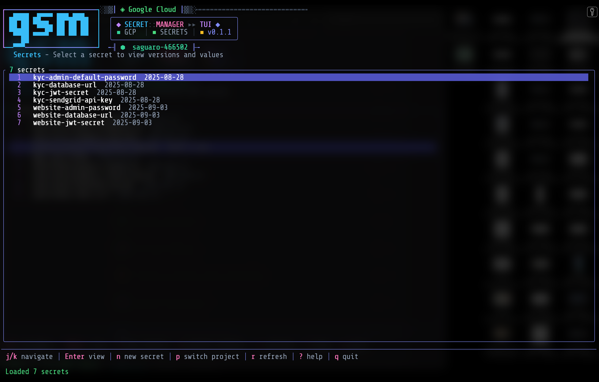

# gsmtui

[](https://github.com/jotacamou/gsmtui/actions/workflows/ci.yml)
[](https://github.com/jotacamou/gsmtui/releases)
[](https://opensource.org/licenses/MIT)

A terminal UI for managing Google Cloud Secret Manager secrets.

## Screenshot

<!-- TODO: Add screenshot -->


## Features

- Browse and search secrets across projects
- View, copy, and manage secret versions
- Enable/disable/destroy versions
- Create new secrets and add versions
- Switch between GCP projects

## Prerequisites

1. Install the [Google Cloud SDK](https://cloud.google.com/sdk/docs/install)

2. Authenticate with Google Cloud:

```bash
gcloud auth application-default login
```

## Installation

```bash
cargo install --path .
```

## Usage

```bash
# Open project selector
gsmtui

# Start with a specific project
gsmtui -p my-project-id
```

## Keyboard Shortcuts

| Key | Action |
|-----|--------|
| `j/k` or arrows | Navigate |
| `Enter` | Select / View details |
| `Esc` | Go back |
| `n` | New secret |
| `a` | Add version |
| `s` | Show/hide secret value |
| `c` | Copy to clipboard |
| `e/x` | Enable/disable version |
| `d` | Delete secret / Destroy version |
| `p` | Switch project |
| `r` | Refresh |
| `?` | Help |
| `q` | Quit |

## Building

```bash
cargo build --release
```

## License

MIT
